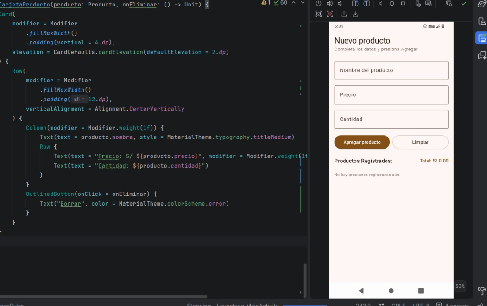
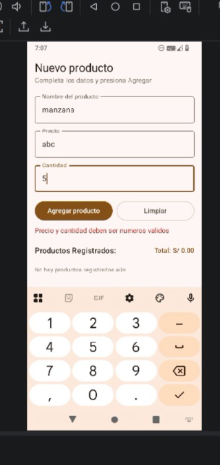

# Lab03RegistroProducto

**Nombre:** Yony Ortiz Sifuentes  
**Curso:** Programación en Móviles  
**Docente:** Juan León

## Descripción

App desarrollada con Jetpack Compose que permite registrar productos (nombre, precio, cantidad), calcular el importe (precio × cantidad) y mostrar la lista de productos registrados con su total acumulado.

## Capturas

### Pantalla inicial (formulario vacío)

### Pantalla con producto registrado

## Pregunta de reflexión

**¿Qué pasaría si declaras las variables de los campos SIN `remember`?**

Si quitamos `remember` (dejando solo `mutableStateOf`), cada vez que el usuario escribe un carácter en un `OutlinedTextField`, Compose redibuja la pantalla (recomposición) y la variable vuelve a reiniciarse a su valor inicial `""` (cadena vacía). Por lo tanto, el texto ingresado no se conserva y resulta imposible escribir en los campos.

## Mejora con IA

| Prompt que usé | Qué generó Gemini | Qué acepté o corregí (y por qué) |
|---|---|---|
| Le pedí a Gemini que agregara validación de campos vacíos con mensaje en rojo (en vez del Toast) y un botón "Limpiar", sin tocar la lógica de lista de productos ni el diseño existente. | Gemini agregó el mensaje de error en rojo debajo del botón y el botón "Limpiar" en una fila junto al botón de agregar, respetando la lista de productos y el cálculo del total acumulado. | Acepté la validación y la estructura del botón "Limpiar". Ajusté los espaciados en el layout y verifiqué que la acción de limpiar reiniciara tanto los tres campos como el mensaje de error de forma clara. |
