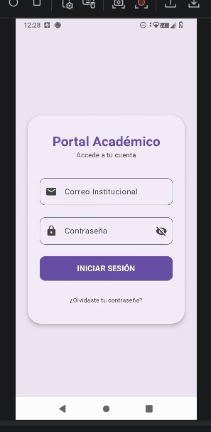
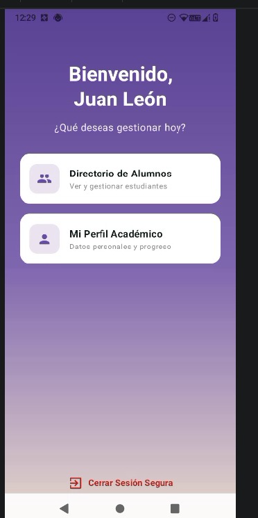
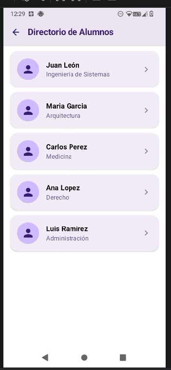
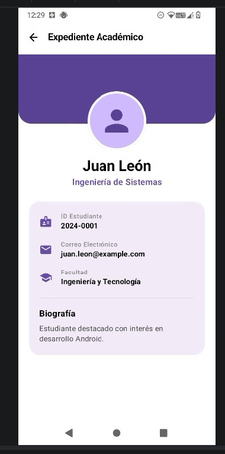

# 🎓 App Portal Académico - Jetpack Compose

Aplicación móvil desarrollada en **Android con Kotlin y Jetpack Compose (Material 3)**. Implementa un sistema de navegación completo con `NavHost`, paso de argumentos tipados y una interfaz moderna adaptada a maquetas de diseño académico.

---

## 📱 Capturas de Pantalla

|                Inicio de Sesión                |            Menú Principal            |      Directorio       |         Expediente         |
|:----------------------------------------------:|:------------------------------------:|:---------------------:|:--------------------------:|
|     | | |    |

---

## 🛠️ Tecnologías Utilizadas

- **Lenguaje:** Kotlin
- **UI Framework:** Jetpack Compose (Material 3)
- **Navegación:** Navigation Compose (`NavHost`, `navController`)
- **Arquitectura:** Patrón basado en pantallas moduladas por paquetes.

---

## 🚀 Prompt Utilizado para la Generación (IA / Gemini)

<b>Click para desplegar el Prompt completo usado en la construcción</b>

> **Actúa como un desarrollador experto en Jetpack Compose y Kotlin para Android.**
>
> Necesito crear una aplicación de navegación académica con **Jetpack Compose (Material 3)**. Diseña las pantallas con una paleta de colores basada en **tonos violeta/morado (`#6750A4` y `#ECE6F0`)**, bordes redondeados en las tarjetas y sombras suaves. Usa componentes nativos e íconos de Material Icons (`Icons.Filled`).
>
> Construye el proyecto con la siguiente estructura de pantallas:
>
> 1. **`LoginScreen` (Pantalla de inicio de sesión):**
     >    - Fondo claro (`#ECE6F0`) con una tarjeta central flotante redondeada (`RoundedCornerShape(28.dp)`).
>    - Título: **"Portal Académico"** y subtítulo **"Accede a tu cuenta"**.
>    - Dos campos de texto con borde (`OutlinedTextField`):
       >      - **Correo Institucional** (ícono izquierdo: `Email`).
>      - **Contraseña** (ícono izquierdo: `Lock`, e ícono derecho para alternar visibilidad con `Visibility`/`VisibilityOff`).
>    - Botón morado **"INICIAR SESIÓN"** que navega a `HomeScreen`.
>    - Enlace inferior de **"¿Olvidaste tu contraseña?"**.
>
> 2. **`HomeScreen` (Menú principal):**
     >    - Fondo con **gradiente vertical morado**.
>    - Título centrado en blanco: **"Bienvenido, Juan León"** y subtítulo **"¿Qué deseas gestionar hoy?"**.
>    - Dos tarjetas blancas seleccionables (`Card`):
       >      - **"Directorio de Alumnos"** (ícono `People`) -> Navega a `ListScreen`.
>      - **"Mi Perfil Académico"** (ícono `Person`) -> Navega a `DetailScreen`.
>    - En el pie de página, un botón rojo con el ícono `ExitToApp` para **"Cerrar Sesión Segura"** que regresa al `LoginScreen` limpiando el *backstack*.
>
> 3. **`ListScreen` (Directorio de Alumnos):**
     >    - `TopAppBar` con el título **"Directorio de Alumnos"** y botón de retroceso (`ArrowBack`).
>    - `LazyColumn` con tarjetas blancas/lila (`#F3EDF7`) que representan a cada alumno:
       >      - Avatar circular con ícono de persona, **Nombre del estudiante**, **Carrera** y una flecha indicadora a la derecha (`KeyboardArrowRight`).
>    - Incluye al menos 5 estudiantes de prueba. Al hacer clic en un estudiante, navega enviando su `id` a la pantalla de detalle.
>
> 4. **`DetailScreen` (Expediente Académico):**
     >    - `TopAppBar` con el título **"Expediente Académico"** y botón de retroceso.
>    - Cabecera morada con un **avatar circular superpuesto en el centro**.
>    - Nombre centrado (**"Juan León"**) y carrera (**"Ingeniería de Sistemas"**).
>    - Tarjeta flotante con detalles (ID Estudiante, Correo, Facultad y Biografía).

